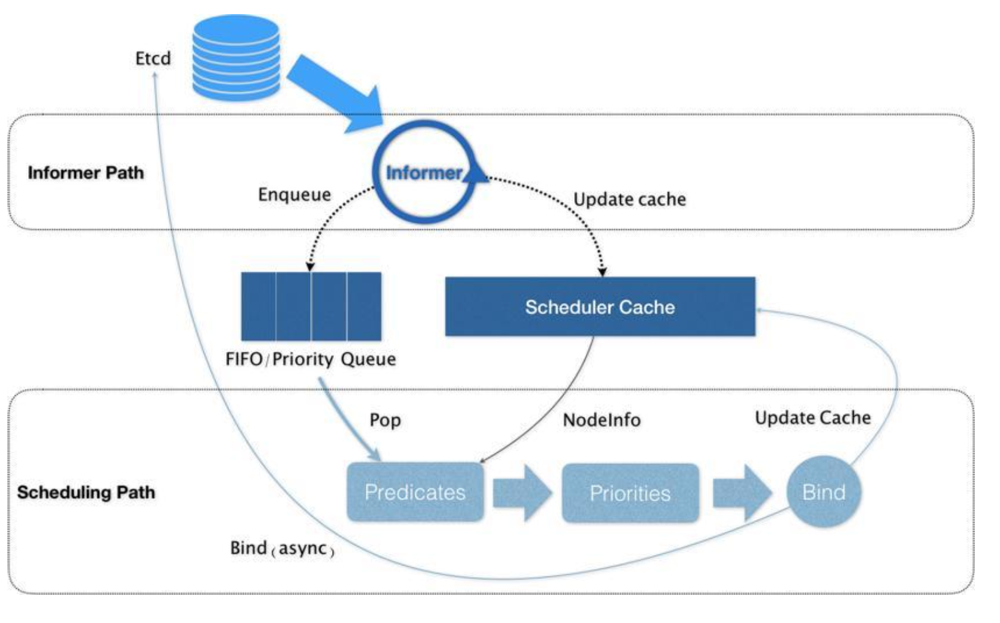

- 如何自己实现一个[[CNI]]插件
	- [相关插件](https://github.com/containernetworking/plugins)
	- [官方提供的 cnitool 工具](https://github.com/containernetworking/cni/tree/main/cnitool)，可以模拟 CNI 被调用的情况
-
- [[k8s scheduler]]
	- 调度策略
		- 使用`request`和`limit`给用户描述Pod 的资源。
		- 在 k8s 的资源设计中，持有这种假设：Pod 申请的资源远大于实际使用的资源。所以，scheduler 分配时，参考的是`request`值。一旦发现超过一定`阈值`的时候，会迅速恢复`limit`值，防止异常。
	- 调度器算法
		- 流程概述
			- 
			- 首先是`Predicate`算法，遍历所有的 Node
			- 在用`Priority`算法，给所有的 Node 打分
			- 最终高分的 Node 被调度
		- `Predicate`的一些细节
			- 一种是`GeneralPredicates`检测，包括：NodeName、NodePort、NodeAffinity 的检测。
			- 一种是关于`Volume`的检测，
			- 一种是和 Node 相关的检测，包括：Toleration、Taint、Node 系统资源(内存、CPU)
	- 默认调度器的优先级和抢占机制
		- 主要有`Priority`和`Preemption`两种。
		- 目的：在Pod 调度失败后，可以抢占低优先级的 Pod，从而使得该 Pod 能够被调度。
		- k8s 提供了`PriorityClass`这个 Kind 用于定义一个优先级。然后 Pod 的 yaml 就可以通过`priorityClassName`来引用这个优先级。
		-
		-
		-
- [[k8s]]的 [[QoS]] 模型
	- k8s 抽象了自己的 QoS 模型，创建了不同的 QoS 类别，在集群资源吃紧的时候，会根据优先级依此 Evict 不同级别的 Pod。
	- Qos 的分类
		- Guaranteed
			- 每个container 都必须有mem limit 和 mem request
			- 每个 container 必须满足 `mem limit = mem request`
			- 每个 container 必须有 CPU limit 和 CPU request
			- 每个 container 必须满足 `CPU limit = CPU request`
		- Burstable
		- BestEffort
	- Eviction 策略
		- k8s 有一个 Eviction 的策略，按照几个维度来判断是否资源紧张：
			- memory.available —— Node可用内存
			- nodefs.available —— Node 文件系统空间
			- nodefs.inodesFree —— Node 文件系统 inode
			- imagefs.available —— Node 容器 runtime 镜像剩余空间
		- 设置eviction 策略：
		  ```
		  kubelet --eviction-
		  hard=imagefs.available<10%,memory.available<500Mi,nodefs.availa
		  ble<5%,nodefs.inodesFree<5% --eviction-
		  soft=imagefs.available<30%,nodefs.available<10% --eviction-
		  soft-grace-period=imagefs.available=2m,nodefs.available=2m --
		  eviction-max-pod-grace-period=600
		  ```
		- `Hard`模式
			- 在达到阈值时，马上开始执行 Eviction。
		- `Soft`模式
			- 达到阈值时，等待一定时间再开始执行 Eviction。
		- Eviction 优先级
			- 1. BestEffort
			  2. Burstable
			  3. Guaranteed
			-
			-