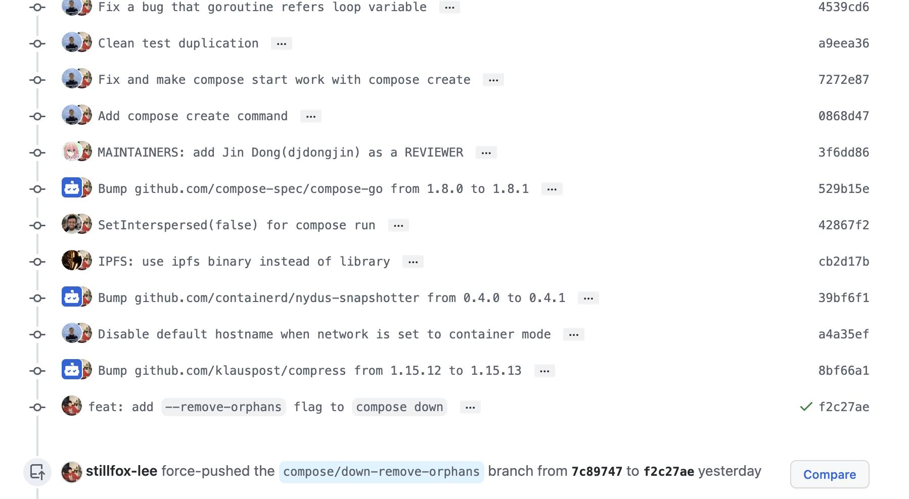
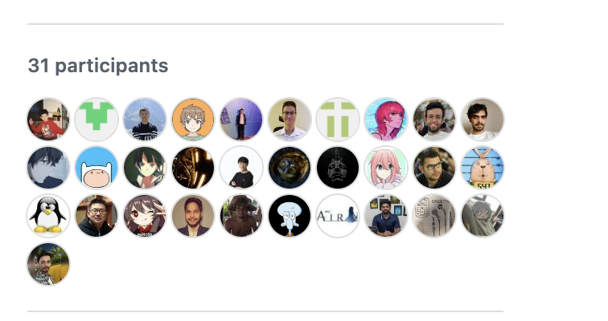

- 如何在多个交织的 commits 中将自己的 commits 压缩为一个？#git
	- 
	-
	- [[git]] 快速获取某个作者的所有 commit：
		- `git log --author="Foo" --pretty=oneline`
	- 再通过`git rebase -i HEAD~X` 指定需要 squash 的 commits 数量
		- > 一般情况下，一个 PR 对应的就是一个 branch。所以，这里 commits 的数量就是这个branch中自己提交过的 commits 的数量。
		- > 如果是 Merge Master 的 commits ，在这个场景中是不会计入的。例如包括 Merge Master (2 个)在内一共有 6 个 commits，那么就是 `HEAD~4`。
		- 在交互的窗口中，需要把自己的 commits 放到最后，再标记好`pick`和`fixup`即可。
		- 就像这样： 
		-
	- 问题是 ，GitHub 会把所有之前的 PR 都当做我的commits来处理：
	- 
	- 还拉了一堆之前的 PR 的人，我简直是社死现场
		- 
	- 最终通过在 master 上重新创建一个分支，再重新 force push成功解决：
		- git checkout main
		- git pull upstream main
		- git checkout repair
		- git cherry-pick XXX(commit-id)
		- git branch --set-upstream-to origin/compose/down-remove-orphans
		- git push --force origin repair:compose/down-remove-orphans