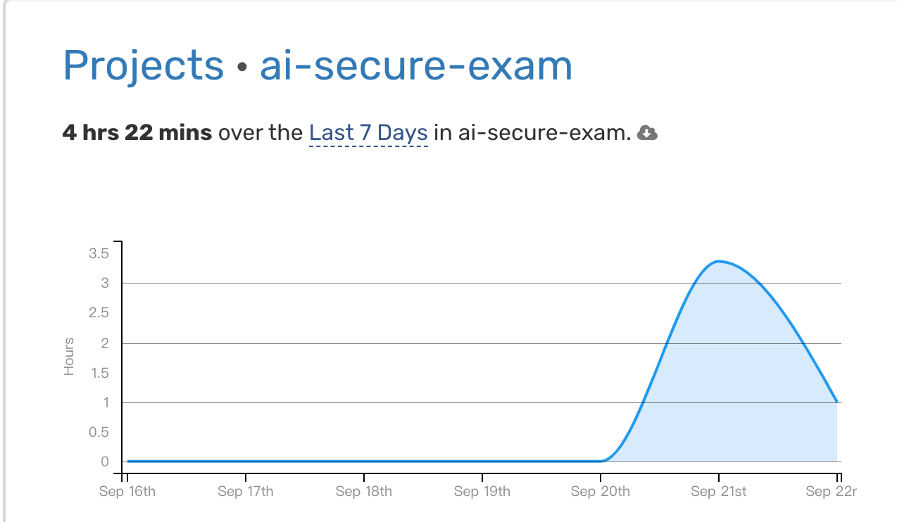

- Cursor 开发 Chrome 插件初体验
	- 先上结论，花费大概 4 个小时，完成了插件的开发。
		- 
		- 统计大概是 4小时 22 分钟，实际大概是 3 小时的时间。
	- 我的背景：完全没有任何 plugin 开发的背景，甚至于连 web 开发的经验也不多，最多会一点点 jQuery+bootstrap。
	- 很强的体现
		- 通过在线 API 文档集成接入的能力。我输入了 deepseek 的 chat api 文档，用自然语言描述了需求。它完成了 AI 接口的接入。
		- 面对复杂的需求，它可以先拆分，再实现部分逻辑。同时对于后面可能需要做出调整的部分给出建议。
	-
	- 待验证能力
		- debug 能力，待后一步探索。（plugin 还有部分问题，可以留待后面探索 debug 能力。）
		- 软件工程能力
			- 因为这次是开发小工具的场景，本身不会在意设计建模、可维护性等等。
	-