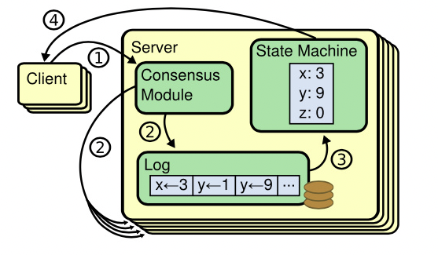

- [中文翻译版论文](https://github.com/maemual/raft-zh_cn/blob/master/raft-zh_cn.md)
- # Raft 论文摘要 #paper
	- > Raft 是一种为了管理 Replicated log 的一种 #共识算法 Raft 主要包含了一下几个模块：**领导人选举**、**日志复制**和**安全性**。它通过一个更强的一致性来减少需要考虑的状态数量。
	- ## 复制状态机 #[[State Machine Replication]]
		- 
		- 通过一个**共识模块**，将 client 的请求存储为一些列的日志。将这些日志按照同样的顺序，在集群的其他节点重新执行，这样就能实现集群中的节点都有一致的状态了。
		-
	-