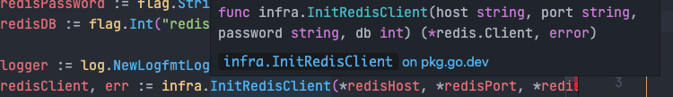
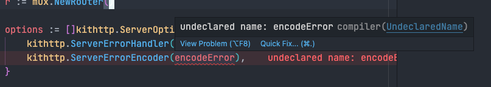

- 调试快捷键： `cmd+shift+p`，toggle keyboard troubleshooting
- 查看当前可以执行的命令：
	- 
- id:: 63e49cb3-982c-4761-9d94-62b211305e02
- TODO 一些需要的快捷操作
	- 显示提升浮窗
	  
		- ```json
		      {
		          "key": "space k",
		          "command": "editor.action.showHover",
		          "when": "editorTextFocus && editorReadonly"
		      },
		      {
		          "key": "cmd+k cmd+i",
		          "command": "-editor.action.showHover",
		          "when": "editorTextFocus && editorReadonly"
		      },
		  ```
	- 显示错误。*移动到错误并且显示*
	  
- 输入时触发提示：`cmd I`
-