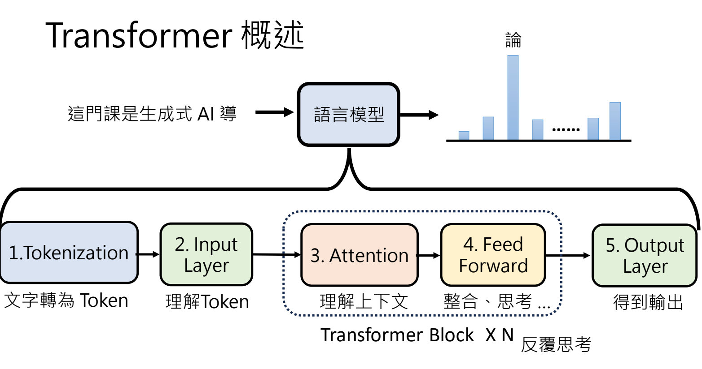

- [[2025 AI Agent 介绍]]
-
- 2025 李宏毅 LLM 内部运作原理
	- [slide](https://docs.google.com/presentation/d/1dmR4HtycPwofpOEgmdjqMdlTsTtfYcFR/edit#slide=id.p1)
	- 预先课程
		- 2021 self-attention
		- 2021 Transformer
		- 2024 第 10 讲 Transformer
		- 2021 机器学习可解释性
		- 2024 第 11 讲
- 2024 Transformer
	- 核心：LLM 核心就是做“文字接龙”
	- 架构：
	  
	- Input Layer —— Embedding。通过查表，把 token 对应的 Embedding 值找出来。